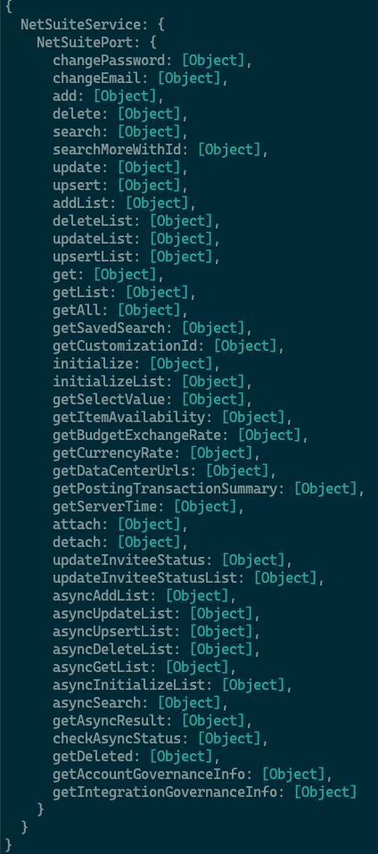

# Netsuite SOAP API Proof of Concept

Here you will find a proof of concept for connecting to a SOAP API using typescript and node.js

To run the examples, first you will need to create a `.env` file and set the values. These values can be found in the Postman environment.

```
NETSUITE_SERVICE_URL=""
NETSUITE_ACCOUNT=""
NETSUITE_CONSUMER_KEY=""
NETSUITE_CONSUMER_SECRET=""
NETSUITE_TOKEN_ID=""
NETSUITE_TOKEN_SECRET=""
```

Before running the program for the first time, you will need to ensure dependencies are installed:

```
$ yarn install
```

With the environment setup and dependencies installed, you can now run:

```
# describe the API - this lists the available methods from the SOAP API
$ yarn describe

# call the search vendors endpoint
$ yarn vendors  

# TODO call the search accounts endpoint
$ yarn accounts

# TODO call the search employees endpoint
$ yarn employees
```

## TODO
* Add call to "accounts"
* Add call to "employees"

## Proof of concept detail

This PoC uses the [node-soap](https://github.com/milewise/node-soap) library to make SOAP API requests.

The examples in this PoC target the "search vendors", "search accounts" and "search employees" endpoints of the Netsuite SOAP API.

```
# This also installs the required type definitions 🎉
$ yarn add soap
```

Once installed, we can import the library:

```ts
import { createClientAsync } from "soap";
import { netsuiteSoapEnvironment as environment } from "./environment";
```

Then, create a soap client:

```ts
const { wsdl, endpoint } = environment;
const client = await createClientAsync(wsdl, {
  endpoint,
  useEmptyTag: true
});
```

`client.describe()` can be used to display a list of available methods. Below is an example output from the describe function



Before making requests, we need to setup the API security model. Netsuite uses a security model known as "token passport" which isn't natively supported by `node-soap`, however, it is possible to provide an implementation of the library's `ISecurity` interface. An example of how this can be done can be found [here](services/netsuite/security.ts).


### SOAP Request Headers

When performing some requests, it may be necessary to attach additional SOAP headers. For example, when making "search" type requests, we need to specify the desired page size

```ts
client.addSoapHeader(() => {
    return {
        preferences: {
            runServerSuiteScriptAndTriggerWorkflows: false,   
        },
        searchPreferences: {
            pageSize: 10,
            bodyFieldsOnly: false
        }
    }
});
```

The above will result in the following XML being added to the `<soap-env:Header>` node

```xml
<preferences>
  <runServerSuiteScriptAndTriggerWorkflows>
    false
  </runServerSuiteScriptAndTriggerWorkflows>
</preferences>
<searchPreferences>
  <pageSize>1000</pageSize>
  <bodyFieldsOnly>false</bodyFieldsOnly>
</searchPreferences>
```

### Making the request

With the client configured, we can start sending requests. `node-soap` works by dynamically creating methods that it finds in the WSDL definition and attaching them to the `client` object we created earlier. It's clever enough to create both sync and async version of the methods, with the async methods named with an "Async" suffix. The return type of the async methods is roughly `Promise<[data: Object, rawResponse: string, metadata: Object, rawRequest: string]>`

**For example:** An API method defined in the WSDL as "search" will result in there being a `client.search(args, callback)` _and_ a `client.searchAsync(args)` method.

Netsuite defines asynchronous methods that work differently from traditional `async/await` methods, however, there are also async versions of these methods, resulting in method names such as `asyncAddListAsync()`.

An example of a search request:
```ts
// response will be of type any
const [response] = await client.searchAsync(args);
const data = response.searchResult.recordList.record.map((item) => ({...}));
```
